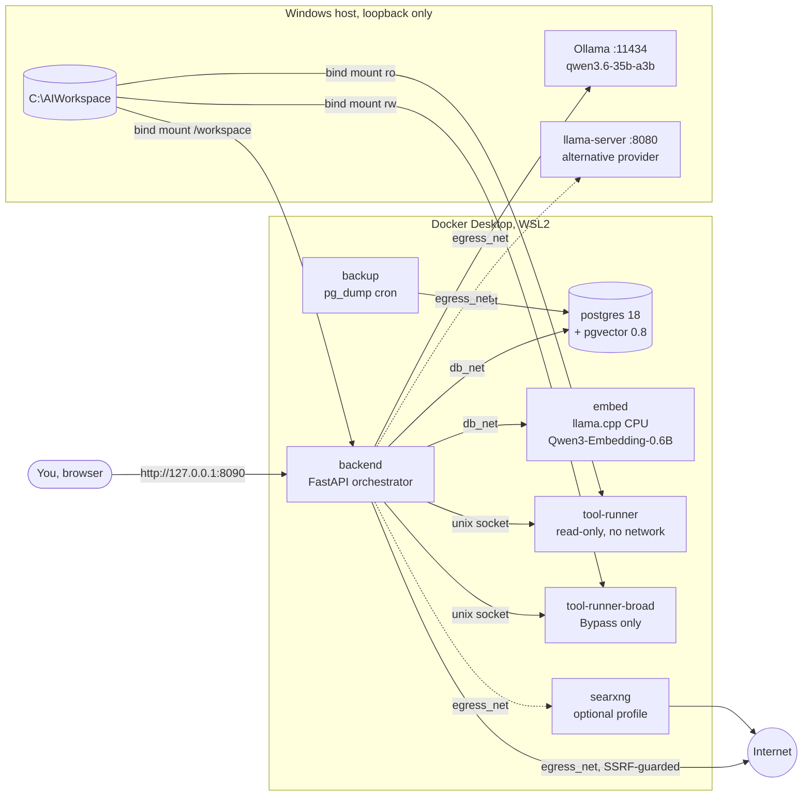
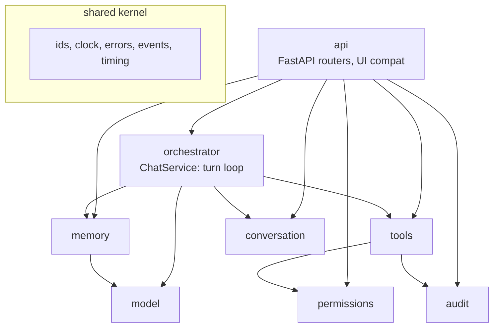
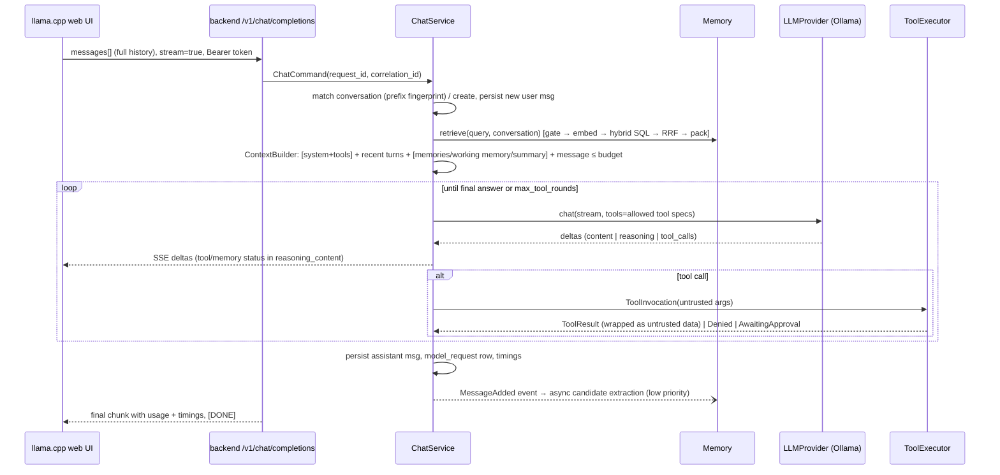
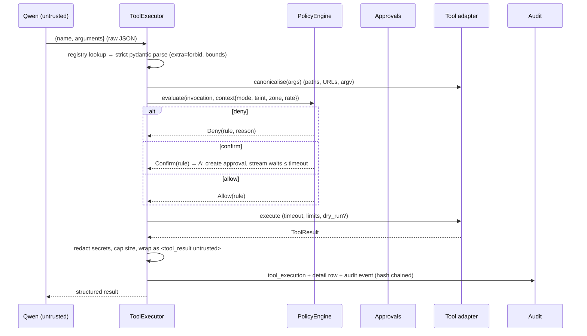

# Architecture

Local AI platform around Qwen3.6. It adds persistent memory, policy-controlled tools (filesystem, shell, web) and an autonomous mode that the model cannot widen. Everything runs on one Windows laptop, and every listener is bound to loopback.

Status: **implemented (2026-09-20)**. Design reviewed on 2026-09-19. After that review you asked for separate memory, embedding, tool and model-response tables, for permissions to be managed in the database and admin console, and for a Bypass mode. Items first marked *(verify)* were verified during the build and are noted inline.

## 1. Goals and non-goals

| Goal | Measure |
|---|---|
| Memory across chats | A preference stated in chat A is used in chat B without being repeated |
| Bounded context | The prompt never exceeds the configured budget, and no full history or memory dump is sent |
| Controlled agency | Every tool call is validated, policy-checked, audited and sandboxed. The model can't change policy |
| Low overhead | Internal operations (API + DB + context build, excluding embedding and inference) target p50 < 2 ms, measured per stage |
| Keep existing setup | The llama.cpp web UI stays unmodified, the GGUF files aren't moved, and llama.cpp scripts keep working |

Non-goals:
- multi-user SaaS (the schema has `user_id` so it can grow, but auth is for one local user)
- remote access
- GPU in Docker (Iris Xe has no WSL2 Vulkan passthrough for containers)
- replacing the llama.cpp UI

## 2. Environment (Phase 1 findings)

| Item | Value |
|---|---|
| Host | Windows 11 Pro 26200, i7-1355U 10C/12T, 39.7 GB RAM, Iris Xe (shared memory), 374 GB free on C: |
| Model runtime today | llama.cpp `llama-server` (Vulkan), `C:\llm\scripts\start.ps1`, `127.0.0.1:8080`, `-np 1`, `--jinja` |
| Models | `Qwen3.6-35B-A3B-UD-Q4_K_M.gguf` (22.1 GB), `Qwen3.6-27B-Q4_K_M.gguf` (16.8 GB) in `C:\llm\models` |
| Ollama | Installed 0.34.2 per-user. The 35B GGUF was imported (`qwen35moe`, capabilities: tools, thinking). It runs on the Iris Xe through Vulkan (`OLLAMA_VULKAN=1`, `OLLAMA_IGPU_ENABLE=1`) and listens on 127.0.0.1:11434 only |
| Docker | Desktop 29.7.2, Compose v5.4, WSL2 backend |
| Other containers | `sqlserver` (exited) publishes `0.0.0.0:1433`. It's unrelated and left alone. See SECURITY.md finding F-0 |
| Host toolchains | MSYS Python 3.14 without pip, broken npm. **All build and test tooling runs in containers** |

## 3. System context



### Deployment view

| Container | Image (pinned by digest at install) | Networks | Host port | Privileges |
|---|---|---|---|---|
| `postgres` | `pgvector/pgvector:0.8.6-pg18-trixie` | `db_net` (internal) | none | image default user `postgres`; `no-new-privileges` |
| `backup` | same image | `db_net` | none | non-root, `cap_drop: ALL`, writes to `platform\backups` only |
| `embed` | `ghcr.io/ggml-org/llama.cpp:server` | `db_net` | none | non-root, read-only rootfs, model mounted read-only |
| `backend` | built from `backend/Dockerfile` (python:3.13-slim) | `db_net`, `egress_net` | **127.0.0.1:8090** only | uid 10001, read-only rootfs, `cap_drop: ALL`, `no-new-privileges`, tmpfs `/tmp` |
| `tool-runner` | built from `tool-runner/Dockerfile` | **`network_mode: none`** | none | uid 10002, read-only rootfs, `cap_drop: ALL`, `no-new-privileges`, `pids_limit 256`, 1 GB, 2 CPU. Workspace mounted **read-only**; only allowlisted read-only commands |
| `tool-runner-broad` | same image | **`network_mode: none`** (→ `runner_net` when you enable shell network) | none | same hardening, workspace read-write. Used **only** in Bypass mode with broad shell enabled |
| `searxng` (profile `search`) | `searxng/searxng` | `egress_net` | none | read-only rootfs |

`db_net` is `internal: true`: containers on it can't reach the internet or the host. Only `backend` sits on both networks. Ollama and llama-server stay bound to `127.0.0.1` on the host. The backend reaches them through `host.docker.internal`, which Docker Desktop forwards to host loopback. Verified: `/health/ready` reports the model OK while Ollama listens on 127.0.0.1 only.

## 4. Bounded contexts



| Context | Owns | Aggregates / key types | Talks to |
|---|---|---|---|
| **conversation** | chats, messages, rolling summary, fingerprint matching | `Conversation` (root) → `Message` | memory (events) |
| **memory** | long-term and short-term memories, lifecycle, retrieval, context building | `MemoryItem` (root, status state machine); VOs `Score`, `Sensitivity`, `MemoryKind`; `ShortTermItem` | model (embedding, extraction) |
| **model** | provider ports and adapters, token counting | `LLMProvider`, `EmbeddingProvider`, `ChatRequest`, `ChatChunk`, `ToolCall` | — |
| **tools** | tool registry, executor pipeline, filesystem/shell/web adapters | `Tool` protocol, `ToolInvocation` (command), `ToolExecution` (root) → `Approval` | policy, audit |
| **permissions** | modes, rules, roots, allowlists (DB, human-managed), decision chain | `PermissionSnapshot` (immutable VO), `Decision`, `Rule`, `Root`, `NetworkEntry` | audit |
| **security** | auth, sessions, tokens, CSRF, host/origin checks, secret redaction | `User`, `ApiToken`, `Session` | — |
| **audit / observability** | hash-chained audit log, metrics, structured logs, stage timings | `AuditEvent`, `StageTimer` | — |

Rules:
- Domain modules import nothing from `api`, and don't import asyncpg or httpx directly. Adapters implement ports, and `main.py` wires them by constructor injection.
- There are no module-level singletons. The `AppContainer` built in `main.py` is the only composition root, and tests build their own with fakes.

Where DDD earns its place:
- the Memory lifecycle, which has real invariants: dedupe, supersede, sensitivity gating
- ToolExecution, a state machine with approvals
- the PermissionSnapshot, an immutable value evaluated by a Chain of Responsibility

Conversation is thin CRUD.

## 5. Chat turn



**Prompt-cache friendly ordering.** The system prompt and the tool schemas the chat template appends to it, followed by
the append-only history, form a stable prefix that the runtime's KV cache can reuse between turns. The per-turn context
block (memories, working memory, rolling summary) is placed immediately before the current message instead of inside the
system message, so a changing memory set no longer invalidates the cached prefix. On this laptop the tool schemas alone
are ~2.3k tokens, which is 10–35 s of prompt processing on the iGPU when it has to be redone.

UI compatibility: the web UI is stateless. It resends the full history on every request and doesn't send a conversation id. The backend:
1. Fingerprints the conversation as `sha256` of the first user message + first assistant reply, then reuses the stored conversation whose fingerprint matches. A new chat has no assistant turn yet, so its first-message fingerprint is resolved against conversations created in the last few seconds.
2. Treats the client history as a *hint*. The prompt is built from stored state within the token budget. Older turns are replaced by the rolling summary, so a long browser chat doesn't push the full history to Qwen.
3. Streams tool and memory status as `reasoning_content`. The UI shows that in its collapsible thinking block and doesn't resend it, so the next prompt stays clean. Status lines use a fixed marker format, e.g. `🔧 filesystem.list ✓ projects/app (3 ms)`.
4. Serves `/props`, `/v1/models` and `/health` itself, so the UI works whether the provider is Ollama or llama.cpp. It doesn't depend on a running llama-server. The UI bundle comes from the pinned llama.cpp server image *(Phase 12 records the exact endpoints the UI calls)*.

Other OpenAI-compatible clients can send an `X-Conversation-Id` header to skip fingerprinting.

## 6. Tool call



`ToolExecution` state machine: `requested → denied | awaiting_approval | approved → running → succeeded | failed | timed_out`. `awaiting_approval → approved | denied | expired`. Transitions are enforced in the aggregate, and each one is audited.

## 7. Provider abstraction

```
LLMProvider (Protocol)                       EmbeddingProvider (Protocol)
  chat(ChatRequest) -> AsyncIterator[ChatChunk]   embed(texts) -> list[vector]
  count_tokens(text) -> int | None                dimensions, model_id
  health() -> ProviderHealth
  ├── OllamaProvider        (/api/chat, native tools, think, options.num_ctx)
  └── OpenAICompatProvider  (/v1/chat/completions: llama-server, vLLM, LM Studio, OpenAI-compatible APIs)
ProviderFactory.from_config(app.yaml)       LlamaCppEmbeddingAdapter | OllamaEmbeddingAdapter
```

The normalised types are `ChatRequest` (messages, tools, temperature, max_tokens, num_ctx, think, timeout), `ChatChunk` (content, reasoning, tool_call deltas, usage, timings) and `ProviderError` (retryable flag).

Retries:
- Only before the first byte of a stream, and only for connection errors and 5xx/503-loading responses.
- Bounded exponential backoff with jitter.
- Never mid-stream, because tokens were already sent to the UI.

Timeouts: connect 3 s; first token 120 s, since a cold model load takes that long; inter-token 60 s.

## 8. Configuration and permissions

| Source | Mounted | Who edits | Holds |
|---|---|---|---|
| `config/app.yaml` | read-only | you, on the host | provider endpoints, context budget, memory thresholds, TTLs, limits, write-denied extensions |
| `config/permissions.yaml` | read-only | you, on the host | the **seed** for permissions (formerly `policy.yaml`). It's loaded only when the permission tables are empty, or when you click "Reset seed rules" |
| DB `permission_settings`, `tool_permissions`, `tool_definitions.enabled`, `workspace_roots`, `network_allowlist` | — | **admin console only**: human session + CSRF + password re-entry | mode (normal/autonomous/bypass), internet mode, Bypass capabilities, taint escalation, shell network, rules, tools on/off, extra folders, LAN and domain allowlists |
| DB `runtime_settings` | — | admin console | model provider, temperature, top-p, context length, max tokens, thinking |
| `secrets/*.txt` | Docker secrets | `platform-setup.ps1` | DB passwords, session key, bootstrap admin password |

**The model can never change permissions.** No tool can reach those tables or the admin API, SSRF blocks loopback, API tokens are refused on permission routes, and every change is audited. The engine reads an immutable snapshot that's rebuilt only when a human changes something.

### Modes

| Mode | Behaviour |
|---|---|
| Normal (default) | Reads run. Writes, deletes, shell and non-GET web requests ask for confirmation |
| Autonomous | Seed rules allow work in `sandbox` and `projects` and deletes in `sandbox`. Destructive actions not covered by a rule are **blocked** |
| Bypass | No confirmations. It also unlocks four capabilities, each with its own switch: **extra folders** (mounted by `platform-up.ps1` after validation), **any shell command** (`sh -c`, inside the sandbox container), **LAN/localhost hosts you list**, and **unrestricted internet** (any public domain, any method). The hard limits in TOOLS.md §3 still apply |

## 9. Key decisions

| # | Decision | Why | Rejected |
|---|---|---|---|
| D1 | Python 3.13 + FastAPI + asyncpg, in Docker | Async streaming, pydantic strict validation for untrusted tool args, OpenAPI for free. asyncpg has the lowest per-query overhead of the Python drivers. The host toolchains are broken, so containers keep the host clean | .NET (not installed), Node (npm broken on host), PowerShell (no async HTTP server or typed validation) |
| D2 | Raw SQL through repositories, no ORM; plain versioned SQL migrations | Hot paths are a handful of hand-tuned queries (hybrid retrieval in one round trip). An ORM adds overhead against the 2 ms target and hides the pgvector/FTS SQL | SQLAlchemy + Alembic |
| D3 | Separate `short_term_memories`, `long_term_memories` and `memory_embeddings` (your choice at review) | Different lifetimes and access paths. Embeddings are keyed by (memory, model), so a model switch re-embeds without downtime | one table with a status column |
| D4 | No Redis | Postgres + an in-process LRU (query embeddings, policy, recent context) meets the latency goal for one user. Adding Redis means another secret and another container | Redis |
| D5 | Shell runs in network-less sidecars over unix sockets, split read-only / read-write | Commands can't reach the network, DB, secrets or the model even if the allowlist is bypassed. The read-only mount makes file changes impossible in restricted mode, rather than relying on argument validation alone (found in the security audit) | exec in backend container; Docker-socket spawned sandboxes (the socket is root-equivalent); one runner with `RLIMIT_FSIZE=0` |
| D6 | Container bind mount = filesystem sandbox | A path-validation bug still can't expose anything outside `C:\AIWorkspace` | host-side process with path checks only |
| D7 | Keep the llama.cpp UI and add an admin console (Jinja + htmx, vendored) | The UI is compiled into llama-server. Forking it would mean maintaining a Svelte fork. The admin console needs no JS build (npm is broken) and works with a strict CSP | forking the web UI, SPA admin |
| D11 | Permissions in the DB (seeded from `permissions.yaml`), editable only by a human | You wanted to manage permissions in the console. The model's lack of any write path, plus elevation, preserves the "model can't widen policy" guarantee | a read-only policy file only |
| D8 | Tool status in `reasoning_content` | It's visible in the UI and isn't replayed into the next prompt | inline content markers (pollute history), MCP from the UI (bypasses server-side memory and policy) |
| D9 | Memory extraction runs after the reply, at low priority | Only one model slot (`-np 1`/RAM). Extraction must never delay a user reply | synchronous extraction |
| D10 | Embeddings on CPU in a container | Keeps the model off host ports and runs alongside Ollama. A 0.6B model is fast enough on CPU for short queries | a second host llama-server; Ollama embeddings (they'd compete with the chat model for the single slot) |
