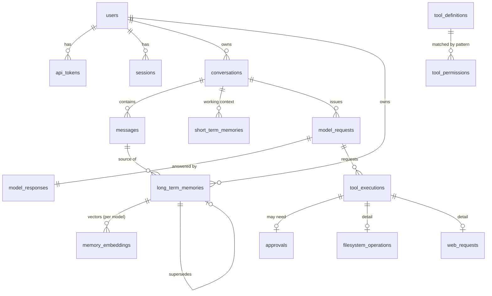

# Database

PostgreSQL **18** + pgvector **0.8.6**, image `pgvector/pgvector:0.8.6-pg18-trixie`. It runs in its own container (`aiplatform-postgres-1`), separate from your SQL Server container. The source of truth is `db/migrations/*.sql`, and this document describes it.

## 1. Deployment

| Setting | Value |
|---|---|
| Container | `postgres`, `restart: unless-stopped`, healthcheck `pg_isready` every 10 s, `mem_limit: 1g` |
| Storage | Named volume **`aiplatform_pgdata`** → `/var/lib/postgresql` (PG18 layout). It survives `docker compose down`, container recreation and reboots. Only an explicit `docker volume rm aiplatform_pgdata` deletes it |
| Network | `db_net`, which is `internal: true`: no internet and no host route. **There's no `ports:` mapping**, so `Test-NetConnection 127.0.0.1 -Port 5432` → `False` (verified). For an admin shell: `docker compose exec postgres psql -U postgres -d aiplatform` |
| Auth | `scram-sha-256` only (initdb `--auth-host/--auth-local=scram-sha-256`), data checksums on. Superuser password from `POSTGRES_PASSWORD_FILE=/run/secrets/pg_superuser` |
| Tuning (laptop) | `shared_buffers=256MB`, `effective_cache_size=768MB`, `work_mem=8MB`, `maintenance_work_mem=128MB`, `max_connections=60`, `jit=off` (JIT hurts sub-millisecond queries), `track_io_timing=on`, `pg_stat_statements`, `log_min_duration_statement=250` |
| HNSW session settings | `hnsw.ef_search=40`, `hnsw.iterative_scan=relaxed_order`, set once per pooled connection so retrieval is a single round trip |
| Backups | The `backup` service runs `pg_dump -Fc` daily at 02:30 UTC into `platform\backups\aiplatform-YYYYMMDD-HHMMSS.dump`, keeps 14, and checks each archive with `pg_restore -l`. On demand: `scripts\platform-backup.ps1`. Restore: `scripts\platform-restore.ps1 -File <dump>`, which restores into `aiplatform_restore` and verifies row counts and the audit chain. It only replaces the live DB with `-Swap` plus a typed `YES`, and it takes a fresh backup before the swap |

## 2. Roles (least privilege)

| Role | Privileges | Used by |
|---|---|---|
| `postgres` | superuser | first-boot bootstrap (`db/init/00-bootstrap.sh`), restore script |
| `aimem_owner` | owns schema `app`, DDL | the one-shot `migrate` container only |
| `aimem_app` | `USAGE` on `app`; `SELECT/INSERT/UPDATE/DELETE` on tables, **no** DDL, `TRUNCATE`, `REFERENCES` or `TRIGGER`. On `audit_log`: `SELECT, INSERT` only. `statement_timeout=15s`, `idle_in_transaction_session_timeout=30s`, connection limit 40 | backend at runtime |
| `aimem_backup` | `pg_read_all_data`, connection limit 2 | backup service |

`CREATE` on `public` is revoked from `PUBLIC`. Tests verify that the app role can't `CREATE TABLE`, `DROP`, `ALTER`, `TRUNCATE`, `CREATE EXTENSION`, `CREATE ROLE`, `COPY … TO PROGRAM`, `CREATE SCHEMA`, or `UPDATE`/`DELETE` the audit log (`tests/db/test_database.py`).

## 3. Domain model

**Bounded contexts → tables**
- Identity: `users`, `api_tokens`, `sessions`
- Conversation: `conversations`, `messages`
- Memory: `short_term_memories`, `long_term_memories`, `memory_embeddings`
- Tools and permissions: `tool_definitions`, `tool_permissions`, `workspace_roots`, `network_allowlist`, `permission_settings`, `tool_executions`, `approvals`, `filesystem_operations`, `web_requests`
- Model: `model_requests`, `model_responses`, `runtime_settings`
- Audit: `audit_log`
- Plus `schema_migrations`

Conventions:
- Aggregate ids are `uuid DEFAULT uuidv7()` (PG18 native, time-ordered, so btree inserts stay local). High-volume logs use `bigint identity`.
- Timestamps are `timestamptz`.
- Enums are `text` + `CHECK`, which is easier to evolve than `CREATE TYPE`.

## 4. Tables

### Identity
| Table | Key columns | Notes |
|---|---|---|
| `users` | `username` (unique on `lower()`), `password_hash` (argon2id), `must_change_password`, `disabled_at` | bootstrap `admin` must change its password on first login |
| `api_tokens` | `token_hash bytea` unique (SHA-256), `scopes text[]` ⊆ {chat, read, admin}, `expires_at`, `revoked_at` | plaintext shown once |
| `sessions` | `token_hash`, `csrf_hash`, `elevated_until` (step-up auth), `expires_at` | swept by the background sweeper |

### Conversation
| Table | Key columns | Notes |
|---|---|---|
| `conversations` | `fingerprint` (links the stateless web UI to a stored chat), `summary`, `summary_upto_seq`, `message_count`, `token_count` | indexes `(user_id, fingerprint)`, `(user_id, updated_at desc)` |
| `messages` | `(conversation_id, seq)` unique, `role`, `content`, `tool_calls jsonb`, `tool_call_id`, `token_count`, `model_request_id` | tool calls and results are stored too, so the admin console shows the full trace |

### Memory
| Table | Key columns | Notes |
|---|---|---|
| `short_term_memories` | `conversation_id`, `kind` ∈ {task_state, tool_state, note, summary, fact}, `key`, `content`, `data jsonb`, `importance`, **`expires_at`** | unique `(conversation_id, kind, key)`, so it's an upsert. The TTL sweeper deletes expired rows every 60 s |
| `long_term_memories` | `kind` ∈ {preference, fact, project, instruction, decision, context}, `content` ≤ 1000, `content_hash`, generated `tsv tsvector ('simple')`, `importance`, `confidence`, `sensitivity` ∈ {none, personal, secret}, `status` ∈ {candidate, active, superseded, rejected, expired, deleted}, `source_type` ∈ {user_stated, model_extracted, tool_output, web, manual, import}, `source_conversation_id`, `source_message_id`, `source_ref`, `supersedes_id`, `flags`, `expires_at`, `access_count`, `last_accessed_at` | **exact dedupe enforced by** `UNIQUE (user_id, content_hash) WHERE status IN ('candidate','active')`. GIN on `tsv` for active rows |
| `memory_embeddings` | `(memory_id, model)` PK, `dims`, `embedding vector(1024)` | **HNSW** `vector_cosine_ops (m=16, ef_construction=64)`. One row per embedding model, so a model switch can re-embed without losing vectors mid-way. Rows are deleted when a memory leaves active/candidate |

### Tools and permissions (human-managed; the model has no path to write them)
| Table | Key columns | Notes |
|---|---|---|
| `tool_definitions` | `name` PK, `category`, `description`, `risk` ∈ {read, write, destructive, execute, network}, `input_schema jsonb`, **`enabled`**, `version` | synced from code at startup. `enabled` is yours. `version` bumps when a schema changes |
| `tool_permissions` | `tool_pattern` (`*`, `web.*`, `filesystem.delete`), `mode` ∈ {*, normal, autonomous, bypass}, `scope_type` ∈ {any, path, domain, command}, `scope_pattern` (glob), `effect` ∈ {allow, confirm, deny}, `priority`, `origin` ∈ {seed, admin}, `created_by` | seeded from `config/permissions.yaml`, edited in the admin console |
| `workspace_roots` | `name`, `host_path`, `container_path` (`/workspace/*` or `/extra/*`), `access` ∈ {ro, rw}, `kind` ∈ {zone, extra}, `bypass_only` | extra folders are mounted by `platform-up.ps1` after re-validation |
| `network_allowlist` | `kind` ∈ {public_domain, private_host}, `host` (supports `*.domain`), `port`, `methods[]` | private hosts are only used in Bypass mode |
| `permission_settings` | `mode`, `internet_mode`, `taint_escalation`, `shell_network`, `bypass{…}`, `defaults{mode→risk→effect}` | validated on write. Sensitive keys need an elevated session |
| `tool_executions` | `tool_name`, `arguments` (canonical, redacted), `status`, `decision`, `policy_rule`, `decision_reason`, `mode`, `tainted`, `dry_run`, timings, `result_summary`, `error` | one row per call, including denied and invalid ones |
| `approvals` | `tool_execution_id` unique, `summary`, `expires_at`, `decision`, `decided_by` | pending approvals are shown in the admin console |
| `filesystem_operations` | 1:1 detail: `operation`, `root`, `path`, `dest_path`, `bytes`, `sha256_before/after`, `backup_path` | forensics plus recovery pointer |
| `web_requests` | 1:1 detail: `method`, `url_redacted`, `host`, `resolved_ip inet`, `status_code`, `bytes`, `content_type`, `blocked_reason`, `duration_ms` | |

### Model and observability
| Table | Key columns | Notes |
|---|---|---|
| `model_requests` | `request_id`, `correlation_id`, `provider`, `model`, `purpose` ∈ {chat, extract, summarise, title, bench}, `params`, `context_budget`, `prompt_tokens_est`, `memories_injected`, `tool_round` | one row per model round |
| `model_responses` | `status`, `finish_reason`, `prompt_tokens`, `completion_tokens`, `ttft_ms`, `total_ms`, `tokens_per_s`, `stage_ms jsonb`, `tool_calls`, `error` | 1:1 with the request. Feeds the dashboard |
| `runtime_settings` | `model.provider`, `model.temperature`, `model.top_p`, `model.num_ctx`, `model.max_output_tokens`, `model.think` | admin-console overrides of `config/app.yaml` |
| `audit_log` | `seq` unique, `at`, `actor_type` ∈ {user, model, system}, `actor_id`, `action`, `target`, `outcome`, `request_id`, `correlation_id`, `detail jsonb` (redacted), `prev_hash`, `hash` | append-only (see below) |

### Audit log integrity
- A `BEFORE INSERT` trigger takes a transaction-level advisory lock and sets `seq = last + 1`, `prev_hash = last.hash`, `hash = sha256(prev_hash ‖ seq ‖ at ‖ actor ‖ action ‖ target ‖ outcome ‖ ids ‖ detail)`. The application cannot choose or forge these values.
- `BEFORE UPDATE OR DELETE` and `BEFORE TRUNCATE` triggers raise an error. That applies to the owner role too, so tampering needs superuser access and disabling the trigger.
- `app.audit_verify()` returns the first broken `seq`, or NULL when the chain is intact. It's exposed at `/api/audit/verify` and in the admin console under Audit → Verify.

## 5. Hot queries

| Query | Shape |
|---|---|
| Hybrid retrieval | One statement, two CTEs: vector top-k via HNSW (`embedding <=> $q`, filtered by user, status and expiry with iterative scan) and keyword top-k via GIN (`to_tsquery('simple', $terms)`, OR-of-prefix terms built from sanitised `[0-9a-z]` words only). The results are joined, and RRF fusion plus importance, confidence and recency weighting happen in Python |
| Recent turns | `messages WHERE conversation_id=$1 ORDER BY seq DESC LIMIT n` (unique index) |
| Conversation by fingerprint | `(user_id, fingerprint)` index |
| Exact dedupe | unique partial index `(user_id, content_hash)` |
| Audit insert | advisory lock + last-row lookup on the `seq` unique index |

Every statement goes through asyncpg, which prepares and caches statements per connection. The pool has min 2 and max 10 connections. Measured latencies are in [PERFORMANCE.md](PERFORMANCE.md).

## 6. Migrations

- Files: `db/migrations/NNNN_name.sql`, forward-only. Each runs in its own transaction, and the runner holds an advisory lock so two migrators can't race.
- `app.schema_migrations(version, checksum)` records what ran. **Editing an applied file aborts startup**, so write a new migration instead.
- The `migrate` compose service runs `python -m aiplatform.migrate` as `aimem_owner` on every `platform-up`. The backend waits for it (`service_completed_successfully`).
- Before a destructive migration (drop or rename), run `scripts\platform-backup.ps1` first.
