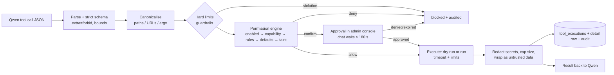

# Tools and permissions

The model asks for a tool through a structured function call. **Every argument is treated as untrusted input.** One code path (`tools/executor.py`) turns that request into an action:

## 1. Catalogue

| Tool | Risk | What it does | Notes |
|---|---|---|---|
| `filesystem.read` | read | read a text file (offset/limit) | binary refused. Secrets in content are redacted before the model sees them |
| `filesystem.list` | read | list a folder (depth ≤ 4) | `.aiplatform/` hidden |
| `filesystem.search` | read | find by name glob and/or literal text | ≤ 20 000 files scanned, 1 MB per file |
| `filesystem.open` | read | metadata, preview and the Windows path for you to open | **does not launch programs** (the container can't, and must not, start processes on Windows) |
| `filesystem.create` | write | new file or directory (fails if it exists) | `O_EXCL`, `O_NOFOLLOW` |
| `filesystem.write` | write | write or replace a whole file | previous version kept in `.aiplatform/versions` (10 per file), atomic replace |
| `filesystem.modify` | write | exact find/replace edits | version kept. `dry_run` returns a unified diff |
| `filesystem.rename` | write | rename within a folder | |
| `filesystem.move` | write / destructive | move, possibly across roots | replacing a file = destructive. The replaced file goes to trash |
| `filesystem.delete` | destructive | delete a file or folder (`recursive` for non-empty) | **soft delete** to `.aiplatform/trash`, kept 30 days. No wildcards |
| `shell.execute` | execute | run a command in the **tool-runner** sandbox | argv only. Outside Bypass: read-only allowlist |
| `web.fetch` | network | GET a URL → title, text, links | SSRF-guarded, 2 MB, content-type allowlist |
| `web.search` | network | DuckDuckGo HTML search → results | results are untrusted |
| `web.request` | network / write | GET/HEAD/POST/PUT/PATCH/DELETE with a body | non-GET only for domains where you enabled the method, or with Bypass unrestricted internet |
| `memory.search` | read | hybrid memory search | |
| `memory.save` | write | propose a long-term memory | goes through the lifecycle pipeline (see MEMORY.md) |
| `memory.forget` | destructive | delete one memory by id | |

All mutating filesystem tools accept `dry_run: true`. The model sees tool names with underscores (`filesystem_read`), because some chat templates reject dots.

## 2. Modes

| | Normal (default) | Autonomous | Bypass |
|---|---|---|---|
| Reads | allow | allow | allow |
| Writes | **confirm** | allow in `sandbox/**` and `projects/**` (seed rules), else confirm | allow |
| Deletes | **confirm** | allow in `sandbox/**`, **confirm** in `projects/**`, **blocked** elsewhere | allow |
| Shell | confirm (read-only allowlist) | allow (read-only allowlist) | allow, **any command incl. `sh -c`** (inside the sandbox) |
| Web GET | allowlisted domains | allowlisted domains | **any public domain** |
| Web POST/PUT/… | confirm, enabled domains only | confirm, enabled domains only | allow, any public domain |
| LAN / localhost | blocked | blocked | **listed hosts only** |
| Extra folders | not visible | not visible | **visible** |
| Script/executable writes (`.ps1`, `.exe` …) | blocked | blocked | allow |

You switch modes in the admin console after re-entering your password. Bypass capabilities can be switched off individually. Rules (`tool_permissions`) can override any default per tool, mode, path, domain or command. For example, `filesystem.delete` / bypass / `projects/important/**` → deny.

**Rule precedence**: highest `priority` wins; on a tie, the more specific rule wins, then deny > confirm > allow. No match → `defaults[mode][risk]`.

**Taint escalation** is off by default, as you asked, and can be switched on in the admin console. When it's on and a turn has read web or other untrusted content, any write, shell, delete or new-domain request needs confirmation again, even in Bypass mode.

## 3. Hard limits (no mode, rule or setting can lift these)

1. **The model can't touch permissions.** No tool reads or writes the permission tables, settings, config or secrets, and there's no route from the tool loop to `/api/permissions` or `/admin` (SSRF blocks loopback and the platform's own ports). Permission changes need a human browser session + CSRF + password re-entry. API tokens get 403 on them.
2. **Only mounted folders exist** for the tools. The workspace is `C:\AIWorkspace`, plus extra folders you add, which `platform-up.ps1` re-checks. Drive roots, `C:\Windows`, `Program Files`, `ProgramData`, user profile roots, `AppData`, `.ssh`/`.aws`/…, the recycle bin and the platform folder itself (secrets) are refused.
3. **Read-only roots stay read-only.** `.aiplatform/` (versions and trash) is invisible and unwritable.
4. **Never reachable from web tools:**
   - container loopback, link-local (`169.254.169.254` metadata), multicast and reserved ranges
   - the platform's Docker networks and service names (`postgres`, `embed`, `tool-runner`, `backend`, …)
   - `host.docker.internal` names
   - on your PC, ports 5432, 8080, 8081, 8090 and 11434 (the model runtimes and the platform)
   - URLs containing credentials, and non-http(s) schemes
5. **The shell runs in a sandbox container**, never on Windows: no network (unless you enable it), no secrets, no DB, non-root, all capabilities dropped, `no-new-privileges`, read-only root filesystem, 256 pids, 1 GB RAM, 2 CPUs, per-command CPU/memory/file-size rlimits, output capped at 64 KB, timeout ≤ 60 s (300 s in Bypass). There are two: `tool-runner` mounts the workspace **read-only** and accepts only restricted commands, and `tool-runner-broad` (read-write) is used only in Bypass mode with broad shell enabled.
6. **Everything is audited**, including invalid and blocked calls.

## 4. Filesystem safety details

Path canonicalisation (`tools/filesystem/paths.py`):
- Accepts `projects/a.txt`, `/workspace/projects/a.txt` and `C:\AIWorkspace\projects\a.txt` (case-insensitive).
- Rejects:
  - `..` anywhere, `%xx` encodings, control characters and NUL
  - UNC and `\\?\` / `\\.\` paths, `~`
  - `:` after the drive (alternate data streams)
  - reserved device names (`CON`, `NUL`, `COM1`, …), trailing dots or spaces, `<>"|?*`
  - over-long paths
- Then applies NFC normalisation, `realpath` and a `commonpath` check against the root. Symlinks that leave the root, or cross into another root, are blocked. Writes refuse symlinks and hard links.

Recovery: every overwrite or modify leaves a copy under `<root>\.aiplatform\versions\`, and every delete moves the item to `<root>\.aiplatform\trash\<timestamp>\`. Both paths are recorded in `filesystem_operations` and shown in the Tool log.

## 5. Shell details

| Mode | What runs |
|---|---|
| Restricted (Normal/Autonomous, or Bypass with broad shell off) — runs in `tool-runner`, workspace **read-only** | argv only, no shell. Allowlist: `ls cat head tail wc grep find tree file stat du diff sort uniq cut tr md5sum sha256sum basename dirname realpath pwd echo date git jq less`. `find` without `-exec/-execdir/-ok/-delete/-fprint*`. `git` read subcommands only (`status log diff show ls-files blame branch rev-parse describe shortlog grep tag`), with no `-c`, `--git-dir`, `--work-tree` or `-C`, and `branch`/`tag` list-only. No output-file flags. `RLIMIT_FSIZE=0` (can't write files) |
| Broad (Bypass + broad shell) — runs in `tool-runner-broad`, workspace read-write | any argv or `sh -c` script, still inside the container. It can only see the mounted folders, and it has network only if you enabled *shell network access* (a separate switch that needs `platform-up.ps1`) |

Each runner re-validates the request itself and refuses a mode it isn't built for (defence in depth), and the read-only mount means a validator gap still cannot change your files.

## 6. Internet details

- Modes (effective mode = Bypass unrestricted if on, otherwise your setting):
  - `disabled`
  - `restricted`: only `network_allowlist` public domains; `*.example.org` matches subdomains
  - `trusted`: listed domains run; others need confirmation
  - `unrestricted`: any public domain
- Guard, always on:
  1. Scheme http/https and ports 80/443. Userinfo, and numeric, octal or hex IP forms, are rejected.
  2. DNS is resolved **once**, and **every** answer must be public, unless the host is a listed LAN target in Bypass. IPv4-mapped, 6to4, Teredo and NAT64 forms are unwrapped first.
  3. The request goes to the **vetted IP** with the original `Host` header and SNI, and certificates are verified. This closes the DNS-rebinding window.
  4. Up to 3 redirects, each fully re-validated. HTTPS→HTTP is blocked.
  5. Content-type allowlist, 2 MB streamed cap (truncated beyond that), 5 s connect and 20 s total timeouts, 30 requests/min globally and 10/min per domain.
  6. URLs or queries that contain secrets are blocked (exfiltration guard).
- HTML is reduced to text, title and links. Nothing is rendered, and results are marked untrusted.
- `web.search` uses DuckDuckGo's HTML endpoint through the same guard. SearXNG is available as an optional compose profile (`platform-up.ps1 -Search`, which needs the image download).

## 7. Approvals

A `confirm` decision creates an `approvals` row and streams this line to the chat:

`⏳ approval needed: write projects/app/main.py (812 bytes) — approve or deny at http://127.0.0.1:8090/admin/approvals`

The Approvals page refreshes every 3 s and shows the canonical arguments, the mode, the reason it asked, and whether the turn read untrusted content. If you don't answer within `tools.approval_timeout_s` (180 s), the model gets "the user expired this action".

## 8. Adding a tool

Create a class with `name`, `category`, `description`, `risk`, `Args` (a `ToolArgs` pydantic model), `timeout_s`, `prepare()` (canonicalise, raise `GuardrailViolation` for hard limits, return a `PermissionRequest`), `run()` and `preview()`. Register it in `main.py`. It appears in `tool_definitions` at the next start, and it's governed by the defaults for its risk until you add rules.
